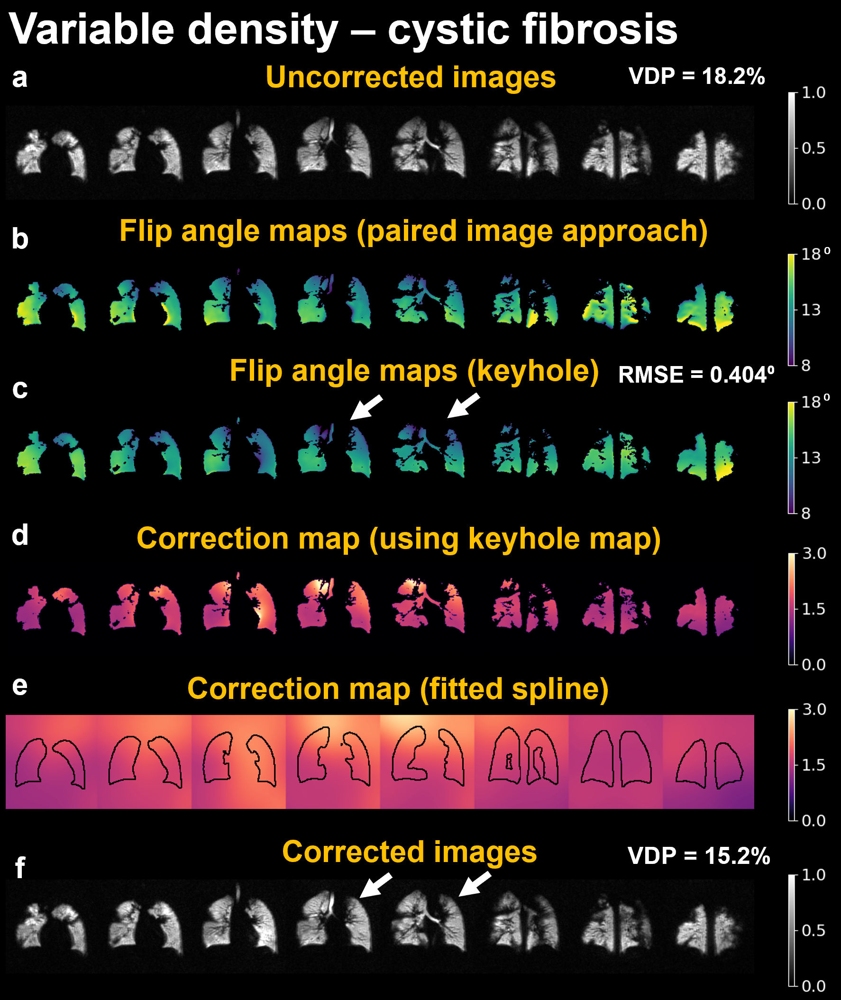

# 2d-spiral-keyhole
A repository that contains reconstruction methods for 2D spiral 129-Xe data, with inclusion of flip angle and N4 corrections. 

- MATLAB simulation scripts can be found in the `matlab\` folder. 
- Python in vivo scripts can be found in the `python\` folder. It is recommended that you set up the Python virtual environment using the instructions below. 

Please post issues to the GitHub repository if you have any questions or improvements.

Written by Joseph Plummer.
joseph.plummer@cchmc.org

Co-authors:
1. Riaz Hussain
2. Abdullah Bdaiwi
3. Matthew Willmering
4. Mariah Costa
5. Juan Parra-Robles
6. Zackary Cleveland
7. Laura Walkup

## Python installation.

Run the following commands in sequence to run the experiments.

1. `conda update -n base -c defaults conda`
2. `make conda`
3. `conda activate spiral-recon`
4. `make pip`

**Troubleshooting**:

1. This repository was tested on an NVIDIA GPU. If running on a system without
   the same, please remove the following packages from `environment.yaml`:
   - `cudnn`
   - `nccl`
   - `cupy`
2. Additionally, if not using an NVIDIA GPU, please set `devnum = -1` for each
   of the `*.py` files.
3. When running `make pip`, `pip install git+https://github.com/mikgroup/sigpy.git@main`
   will error if GitHub ssh keys are not set. If this is the case, install SigPy manually.

## Data.

Sample multi-slice 2D spiral data collected from a healthy participant included inside folder called `data`.

## Run experiments.

Run the scripts inside `matlab` and `python` folders. I recommend using VSCODE with WSL2 for the Python script.

## Uninstall.

To uninstall, run the following commands:

1. `conda activate`
2. `make clean`

## Packages used:

- [SigPy](https://github.com/mikgroup/sigpy)

## DOI.
[10.1002/mrm.30028](https://onlinelibrary.wiley.com/doi/full/10.1002/mrm.30028)

